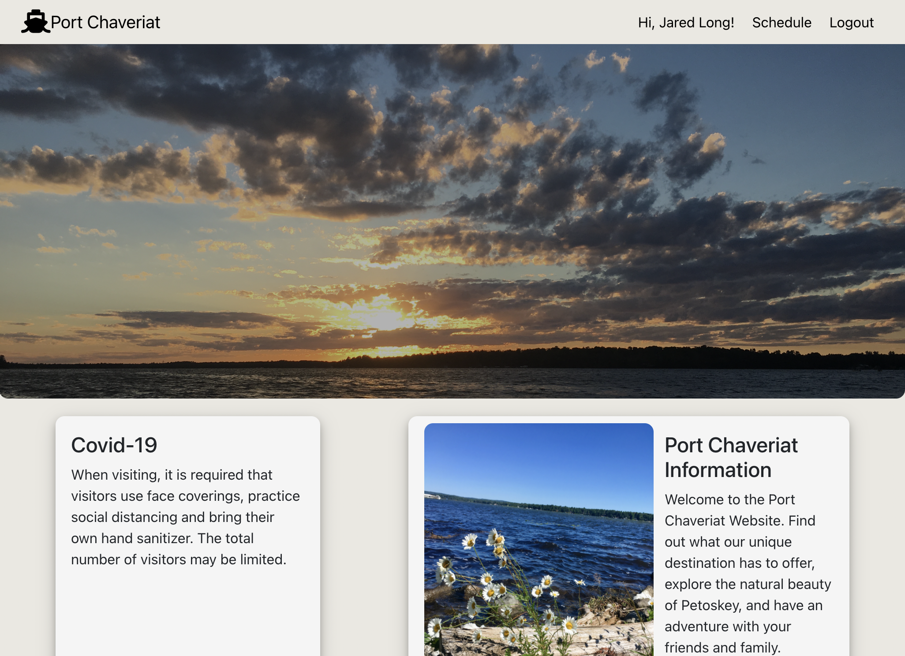
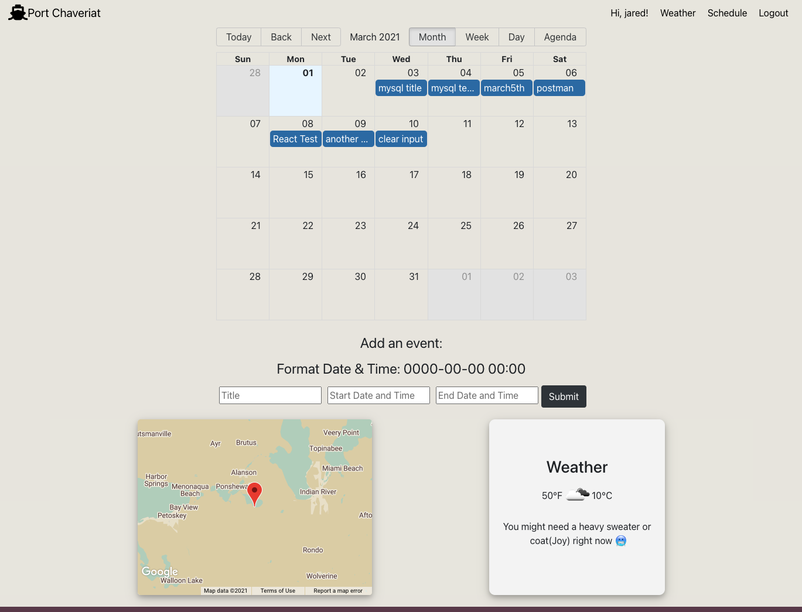
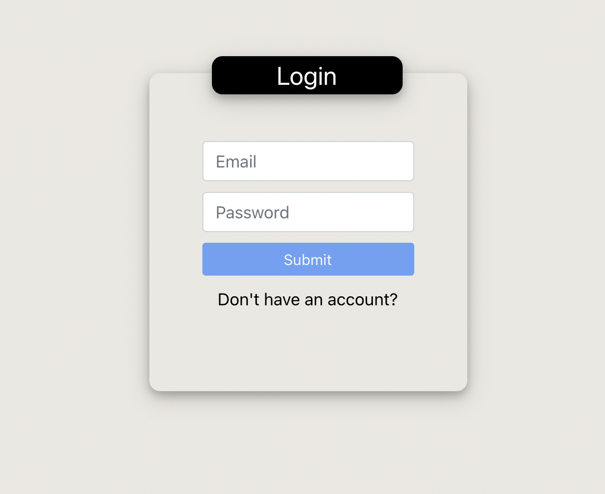
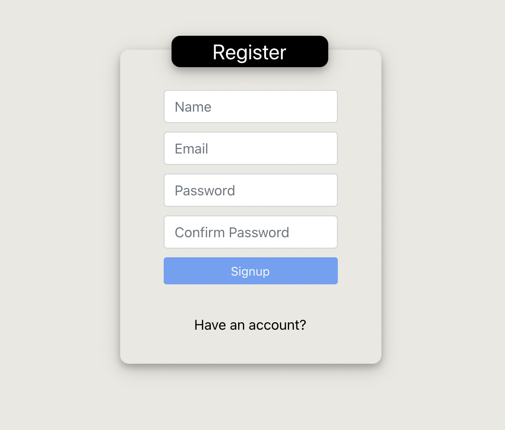

# React.js Port-Chaveriat

This is an application that will be used for scheduling family lake-house events.

## Technologies Used

- React.js
- Node.js, MySQL, Express.js API
- React Router
- Styled Components
- Bootstrap
- Font Awesome
- Google Maps
- Open Weather Map API
- Geolocation
- JsonWebToken
- Moment.js
- react-big-calendar

## Screenshots:

### Home Page:

### Schedule Page:

### Agenda Column View:

### Login and Register Forms:

## Deployed Link:

[Click]() for the deployed application. (coming soon)

## Future Enhancements:

- drag and drop events on calendar
- delete and edit events
